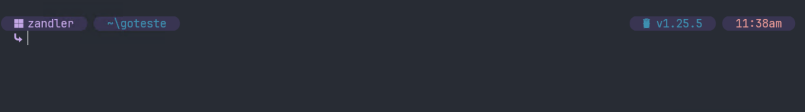
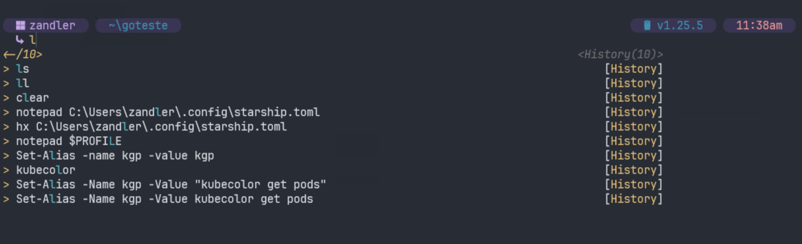
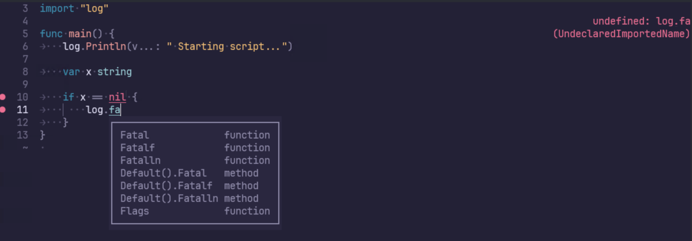

# DOTFILES-WINDOWS


This is look like when finish 


Terminal auto complete with history


Helix editor with full features to golang, python 

## FEATURES
- Syntax highlighting
- Command completion and preview
- SRE tools like kubectl, terraform, k9s, etc.
- Git aliases and shortcuts
- Kubernetes aliases with kubecolor
- Modern terminal experience with Starship prompt

### Gopher users
**air** for local development restart after save

### Python
**uv** for management environment and packages

### SRE`s
Kubecolor 

and other stuff's

### **PLEASE, READ THE FILES ! ! !**

## What
This repo contains PowerShell scripts and configuration files. You can configure your environment for SRE work!

**No admin rights needed**

## Requirements

- Windows 11 (recommended: clean environment)
- PowerShell > 5

## Instructions 

1. Update your system 
2. Run this command in PowerShell **(No local admin needed)**

```powershell
Set-ExecutionPolicy -ExecutionPolicy RemoteSigned -Scope CurrentUser
Iwr -Uri https://raw.githubusercontent.com/Zandler/dotfiles-windows/refs/heads/main/install.ps1 -OutFile install.ps1; ./install.ps1
```

After installation, close terminal and open again. **Voilà**


This script:
- Installs Scoop package manager
- Installs Git
- Clones this repo
- Installs development apps
- Configures terminal
- Installs WSL (if you are local admin, otherwise skips this step)

**If you want to see or install more software, go to https://scoop.sh/#/apps and search for your app.**

after, open bootstrap.ps1 at line 87 and add your package 

After execution, install WSL:

```powershell
wsl --install -d Ubuntu
```

If you need to configure Linux environment, go to dotfiles folder and configure Linux: **[Linux-dotfiles](https://github.com/Zandler/dotfiles)**

## Available Aliases

### File System Aliases
| Command | Executes | Description | Example |
|---------|----------|-------------|---------|
| `ls` | `eza -lbGd --header --git --sort=modified --color=always --group-directories-first --icons` | Enhanced directory listing with icons and git status | `ls` |
| `ll` | `eza --tree --level=2 --color=always --group-directories-first --icons` | Tree view of directories (2 levels) | `ll` |

### Git Aliases
| Command | Executes | Description | Example |
|---------|----------|-------------|---------|
| `ga` | `git add .` | Add all changes to staging | `ga` |
| `gca` | `git commit --amend --verbose` | Amend last commit with verbose output | `gca` |
| `gco` | `git checkout` | Checkout branch or commit | `gco main` |
| `gcob` | `git checkout -b` | Create and checkout new branch | `gcob feature/new-feature` |
| `glbm` | `git for-each-ref --sort=-committerdate --format='%(refname:short) %09 %(committerdate:relative)' refs/heads/` | List local branches by last modified | `glbm` |
| `glbmr` | `git for-each-ref --sort=-committerdate --format='%(refname:short) %09 %(committerdate:relative)' refs/remotes/` | List remote branches by last modified | `glbmr` |
| `gs` | `git status -sb` | Short git status | `gs` |
| `gl` | `git log --oneline` | One-line git log | `gl` |
| `glc` | `git log -1 HEAD --stat` | Last commit with file changes | `glc` |
| `grb` | `git branch -r -v` | List remote branches with details | `grb` |
| `gcm` | `git commit -m` | Commit with message | `gcm "fix: bug in login"` |

### Kubernetes Aliases (using kubecolor)
| Command | Executes | Description | Example |
|---------|----------|-------------|---------|
| `k` | `kubecolor` | Base kubectl command with colors | `k get pods` |
| `kgp` | `kubecolor get pods` | Get pods | `kgp -n default` |
| `kgs` | `kubecolor get svc` | Get services | `kgs -A` |
| `kgd` | `kubecolor get deploy` | Get deployments | `kgd -n production` |
| `kgn` | `kubecolor get nodes` | Get nodes | `kgn` |
| `kgns` | `kubecolor get namespaces` | Get namespaces | `kgns` |
| `kdp` | `kubecolor describe pod` | Describe pod | `kdp my-pod-123` |
| `kds` | `kubecolor describe svc` | Describe service | `kds my-service` |
| `kdd` | `kubecolor describe deploy` | Describe deployment | `kdd my-deployment` |
| `kdn` | `kubecolor describe node` | Describe node | `kdn worker-node-1` |
| `kl` | `kubecolor logs` | Get pod logs | `kl my-pod-123` |
| `klf` | `kubecolor logs -f` | Follow pod logs | `klf my-pod-123` |
| `kex` | `kubecolor exec -it` | Execute command in pod | `kex my-pod-123 -- /bin/bash` |
| `kpf` | `kubecolor port-forward` | Port forward to pod/service | `kpf svc/my-service 8080:80` |
| `ka` | `kubecolor apply -f` | Apply YAML file | `ka deployment.yaml` |
| `kd` | `kubecolor delete` | Delete resource | `kd pod my-pod-123` |
| `kgc` | `kubecolor config get-contexts` | Get available contexts | `kgc` |
| `kcc` | `kubecolor config use-context` | Switch context | `kcc production` |

### Utility Functions
| Command | Description | Example |
|---------|-------------|---------|
| `Get-GitBranch` | Get current git branch for specified path | `Get-GitBranch C:\my-repo` |

Enjoy!!!

